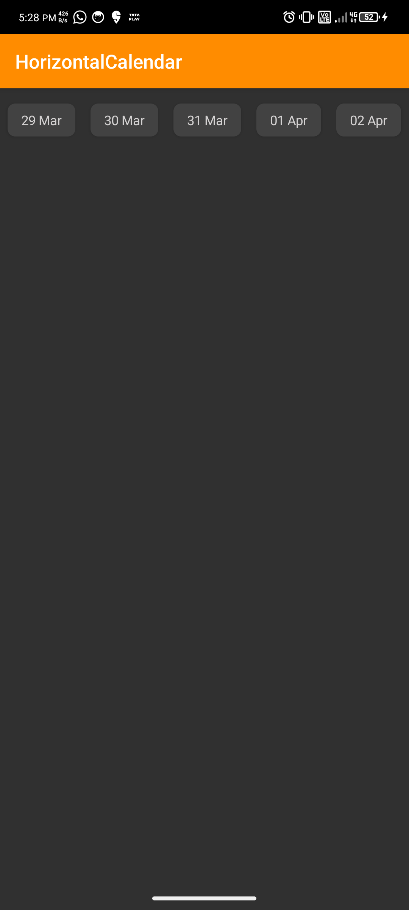
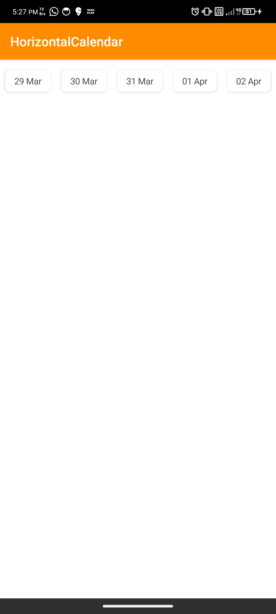

# HorizontalCalendarView Documentation

The **HorizontalCalendarView** is a custom Android view that allows users to navigate and select dates in a horizontal calendar format. This guide explains how to implement, configure, and handle date selection with `HorizontalCalendarView`.


## Screenshots

<p align="center">
  
  
</p>


---

## Implementation

### Step 1: Add the JitPack Repository to Your Build File
Add the following code in your **root `settings.gradle`** file at the end of repositories:

```gradle
dependencyResolutionManagement {
    repositoriesMode.set(RepositoriesMode.FAIL_ON_PROJECT_REPOS)
    repositories {
        mavenCentral()
        maven { url 'https://jitpack.io' }
    }
}
```

### Step 2: Add the Dependency
Add this dependency in your **`build.gradle` (app module)** file:

```gradle
dependencies {
    implementation 'com.github.pramodjinturkar999:HorizontalCalendar:1.0.1'
}
```

### Step 3: Add the View to Your Layout XML
In your XML layout file, include the `HorizontalCalendarView` with appropriate attributes:

```xml
<com.pramod.horizontal_calender.HorizontalCalendarView
    android:id="@+id/horizontalCalendarView"
    android:layout_width="match_parent"
    android:layout_height="wrap_content"
    app:dateColor="#575757"
    app:dateSize="18dp"
    app:selectedDateColor="#ffffff"
    app:selectedDateBackgroundColor="#F57C00" />
```

### Attribute Descriptions
- **`app:dateColor`** — Sets the color of the unselected date text.
- **`app:dateSize`** — Defines the text size for the date values.
- **`app:selectedDateColor`** — Specifies the color of the selected date's text.
- **`app:selectedDateBackgroundColor`** — Defines the background color of the selected date.

---

### Step 4: Initialize the View in Your Activity/Fragment
In your `MainActivity` or desired Fragment, initialize the `HorizontalCalendarView` and configure it as follows:

```kotlin
private lateinit var horizontalCalendarView: HorizontalCalendarView

class MainActivity : ComponentActivity() {
    @SuppressLint("MissingInflatedId")
    override fun onCreate(savedInstanceState: Bundle?) {
        super.onCreate(savedInstanceState)
        setContentView(R.layout.activity_main)

        // Initialize HorizontalCalendarView
        horizontalCalendarView = findViewById(R.id.horizontalCalendarView)

        // Set start and end date range
        val startDate = Calendar.getInstance().time
        val endDate = Calendar.getInstance().apply { add(Calendar.YEAR, 1) }.time

        horizontalCalendarView.setStartDate(startDate)
        horizontalCalendarView.setEndDate(endDate)

        // Handle date selection
        horizontalCalendarView.getSelectedDate { selectedDate ->
            val dateFormat = SimpleDateFormat("dd/MM/yyyy", Locale.getDefault())
            val formattedDate = dateFormat.format(selectedDate)
            Log.d(TAG, "Selected Date: $formattedDate")
        }
    }
}
```

---

### Step 5: Handling Date Selection
The `getSelectedDate` method provides a callback whenever a date is selected. It returns the selected date in `Date` format, which you can format as desired.

**Example:**

```kotlin
horizontalCalendarView.getSelectedDate { selectedDate ->
    val dateFormat = SimpleDateFormat("dd/MM/yyyy", Locale.getDefault())
    val formattedDate = dateFormat.format(selectedDate)
    Log.d(TAG, "Selected Date: $formattedDate")
}
```

---

### Step 6: Additional Notes
- Ensure your project has the necessary dependencies for `SimpleDateFormat`, `Calendar`, and `Log`.
- Customize the date appearance using the provided XML attributes for improved user experience.

For further support or improvements, feel free to contribute to the project repository.

---
**Happy Coding!** 🚀

